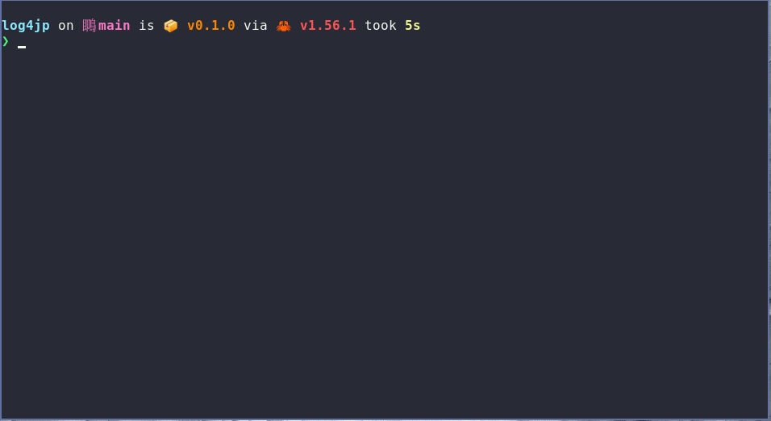

# log4j-portscan

log4j-portscan is a simple little inverse port scanner to determine if you're blocking the default
outbound ports that the log4j exploit (commonly known as log4shell):

[CVE-2021-44228](https://nvd.nist.gov/vuln/detail/CVE-2021-44228)

For more information, check out:

* [ITPNZ Tech Blog](https://techblog.nz/2771-Log4J-When-your-tools-turn-against-you)
* [1Newz TVNZ](https://www.1news.co.nz/2021/12/13/cert-nz-says-new-cyber-threat-being-actively-exploited/)
* [The ExpressVPN blog](https://expressvpn.com/blog/log4shell-protection)

If you run this tool and the test passes, that means that on your current Internet connection, your machine is
not able to connect out on the default ports. Any attacker using those ports, will still be able to get your machine
to request a malicious payload, but your machine won't be able to connect to the malicious server to download it.

This is **not a silver bullet** and only offers the most basic of protection, which is hopefully buying you enough time
to get all of your software check and updated.

Certainly, you should not depend on this tool for anything important!

## Quick demo

I run the test on a network that does not have any port blocking enabled and all the tests fail (as expected). I then 
connect to ExpressVPN (who have implemented port blocking - see the above blog post) and repeat the test. The tests pass
as expected.

This test will work with any method used for blocking those ports, it doesn't have to be a VPN, a router or firewall will do.
There is enough information on this page to implement the protection yourself - but if you'd rather just press a button, then
using ExpressVPN would be a solid option.

## Building the tool

You can build it simply with:

    cargo build --release

However, I'm also a big fan of [Earthly](https://earthly.dev) so you can also build it with:

    earthly +build

## How it works

This tool tries to connect on the default ports this exploit uses, namely:

* 389
* 636
* 1099
* 1389
* 3268
* 3269

Note: If an attacker uses a different port, blocking the default ports
      (and hence the results of this test) are worthless.

The host the app tries to connect to these ports on an AWS instance I
created at http://log4j.the.engineer . nginx is binding to all of the
ports - there's nothing dangerous or malicious hosted.

## You need to upgrade!

Regardless, please make sure you check and update your software! There
are vulnerabilities everywhere, and blocking these outbound ports can only
do so much...

## Fun Experiment
I created this tool in the hope that it would be useful but also so that I
could experiment a little with network control flow in Rust. It was pretty
straight forward to put together, but I'm putting that down to the ease of
working with Rust and the great selection of crates available.